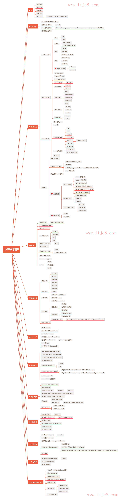

# mpvue-demo

> A Mpvue project

## Build Setup

``` bash
# install dependencies
npm install

# serve with hot reload at localhost:8080
npm run dev

# build for production with minification
npm run build

# build for production and view the bundle analyzer report
npm run build --report
```

For detailed explanation on how things work, checkout the [guide](http://vuejs-templates.github.io/webpack/) and [docs for vue-loader](http://vuejs.github.io/vue-loader).

```
vue init mpvue/mpvue-quickstart my-project
```
```
// package.json 文件 scripts 里面加上下面这段，运行使可以修复代码格式
"lint": "eslint --fix --ext .js,.vue src"
```

## Koa2 入门
基于 nodejs 平台的下一代 web 开发框架
- Express 原班人马打造，更精简
- Async + await 处理异步
- 洋葱圈型的中间件机制
```
npm install koa --save
```
```js
const Koa = require('koa')
const app = new Koa()

app.use(async (ctx, next) => {
	ctx.body = 'hello imooc'
})

app.listen('9092')
```
- ctx 是封装了 request 和 response 的上下文
- next 是下一个中间件

## koa-router

## 搭建本地官方推荐指南
- 本地安装 mysql
  - mac: brew install mysql 启动：mysql.server start
- 指南 https://cloud.tencent.com/document/product/619/11442
- https://console.cloud.tencent.com/capi https://console.cloud.tencent.com/developer 获取密钥和 appid

进入mysql: mysql -u root
新建数据库： create database cAuth;
接下来进 server 目录安装完依赖后 执行：node tools/initdb.js
安装 nodemon 以免每次重启服务：sudo npm install -g nodemon

## 部分笔记
## 项目骨架搭建
```js
// main.js
Vue.config.productionTip = false // 生产环境提示关闭
```

入口的 App.vue 文件里没有template

```
npm install wafer2-client-sdk --save
```

## 请求豆瓣api
请求 https 的api 需要 require('https')

### 预览图片
wx.previewImage({
	current,
	urls
})

### 图书详情页
修改标题栏 title：
```
wx.setNavigationBarTitle()
```
图片渲染模式：image 组件的 mode 属性 选择值 aspectFill（保持纵横比缩放图片）

css 图片模糊属性： `filter: blur(15xp)`

获取手机型号：wx.getSystemInfoSync().model

获取位置：wx.getLocation() 获取经度纬度。通过百度地图web 服务 API，服务文档地理编码。获取密钥

获取路由传参：`this.$root.$mp.query.id`

## 实现自己的 Koa
### Koa 原理
- 基于 node 自带的 http 模块
  - 需要 async 特性，node 版本建议安装7.6+

## 内容回顾
- 涉及到的技术
  - Vue ES6 ES7
  - Koa koa-router knex

## 上线准备
- 开通正式环境
- 购买域名和机器，修改 config 部署线上环境
- 发起代码审核

